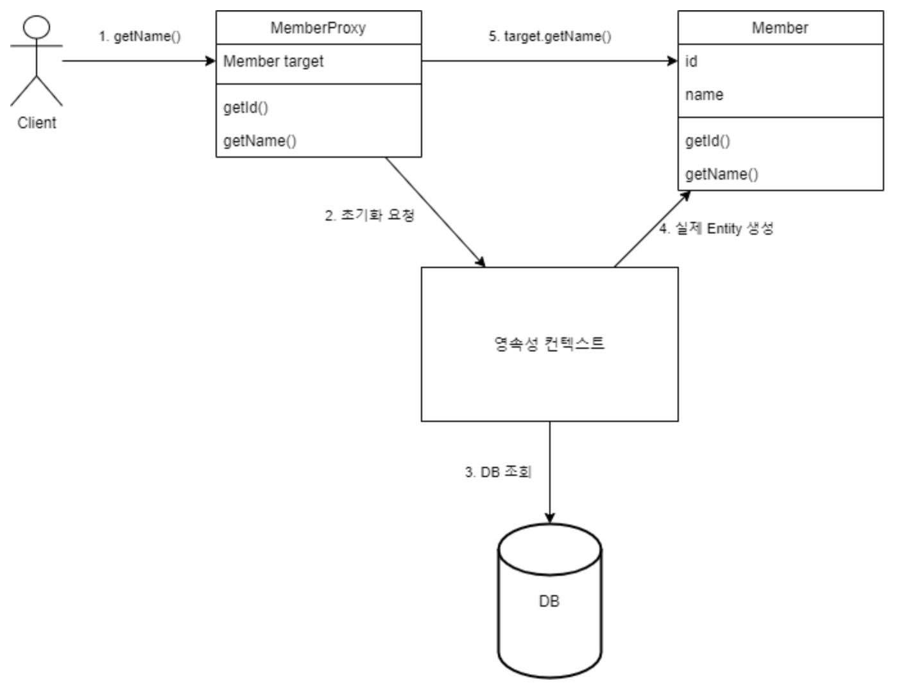

# 프록시(Proxy) - 로딩 전략, 영속성 전이

## 목차

<!-- 목차 -->
- [목차](#목차)
- [개요](#개요)
- [프록시(Proxy)](#프록시Proxy)
  - [프록시 특징](#프록시-특징)
  - [프록시 객체 초기화](#프록시-객체-초기화)
  - [Proxy 초기화 동작 과정](#Proxy-초기화-동작-과정)
  - [프록시 정리](#프록시-정리)
  - [준영속 상태와 초기화](#준영속-상태와-초기화)
- [즉시 로딩과 지연 로딩](#즉시-로딩과-지연-로딩)
  - [즉시 로딩(EAGER LOADING)](#즉시-로딩EAGER-LOADING)
  - [지연 로딩(LAZY LOADING)](#지연-로딩LAZY-LOADING)
  - [JPA 기본 Fetch 전략](#JPA-기본-Fetch-전략)
- [영속성 전이(CASCADE)](#영속성-전이CASCADE)
  - [영속성 전이 : 저장](#영속성-전이-저장)
  - [영속성 전이 : 삭제](#영속성-전이-삭제)
  - [CASCADE의 종류](#CASCADE의-종류)
  - [고아 객체](#고아객체)
  - [영속성 전이 + 고아 객체, 생명 주기](#영속성-전이와-고아객체-생명주기)

<!-- /목차 -->

### 개요

```java
@Entity
@Getter
public class Member{
	private String name;

	@ManyToOne
	private Team team;
}

@Entity
@Getter
public class Team{
	private String name;
}
```

- **위 예제에서 회원의 이름을 조회한다고 가정**
    
    ```java
    public String printUserName(String memberId){
    	Member member = em.find(Member.class, memberId);
    	System.out.prinln(member.getName());
    }
    ```
    
    - **문제점**
        - printUserName() 호출 시, 회원 엔티티와 연관된 팀 엔티티까지 디비에서 함께 조회.
    - **해결 방법 :** 지연로딩 (LAZY)
        - JPA는 이런 문제를 해결하려고 엔티티가 실제 사용될 때까지 디비 조회를 지연하는 방법을 제공

# 프록시(Proxy)

- 지연 로딩 기능을 사용하기 위해선, 실제 엔티티 객체 대신 데이터베이스 조회를 지연할 수 있는 가짜 객체가 필요한데, **이 가짜 객체가 프록시 객체이다.**
- 엔티티를 실제 사용하고 싶은 지점까지 미루고 싶을 때, **`EntityManager.getReference(Class<T> entityClass,Object primaryKey)`** 를 사용하면 된다.

### 프록시 특징

- Proxy Class는 실제 클래스를 상속 받아서 만들어지므로 실제 클래스와 **겉모양은 같다**.
    - 즉, 사용자는 이것이 진짜 객체인지, 프록시 객체인지 구분하지 않고 사용하면 된다.
- 프록시 객체는 실제 객체에 대한 참조(Target)을 보관.
    - 프록시 객체의 메소드 호출 시, 프록시 객체는 실제 객체의 메소드를 호출

### 프록시 객체 초기화

- 프록시 객체는 실제로 사용될 때, 데이터베이스를 조회해서 실제 엔티티 객체를 생성하는데 **이를, 프록시 객체의 초기화라고 한다**.

### Proxy 초기화 동작 과정



```java
//MemberProxy 객체 반환
Member member = em.getReference(Member.class, "id1");

//프록시 객체 초기화 : 1. getName(); - 해당 메소드를 호출하여 실제 데이터를 조회
member.getName(); 

//프록시 클래스 예상 코드
class MemberProxy extends Member{
	//실제 엔티티 참조
	Member target = null;

	public String getName(){
		if(target == null){
			//2. 초기화 요청 - 실제 엔티티가 생성되어 있지 않으면,
			//3. DB 조회 - 영속성 컨텍스트가 데이터베이스르 조회해서 실제 엔티티 객체 생성
			//4. 실제 엔티티 생성 및 참조 보관 - 생성된 실제 엔티티 객체의 참조를 멤버변수에 보관
			this.target = ...;
		}

			//5. target.getName(); - 실제 엔티티 객체의 getName()을 반환
			return target.getName();
	}
}
```

### 프록시 정리

- 처음 사용할 때 한 번만 초기화 된다.
- 초기화한다고 해서 프록시 객체가 실제 엔티티로 바뀌는 것은 아니다.
    - 프록시 객체 초기화 시 프록시 객체를 통해, 실제 엔티티에 접근이 가능해진다.
- 실제 엔티티를 상속받은 객체이므로 타입 체크 시 주의해서 사용해야 한다.
- 영속성 컨텍스트에 찾는 엔티티가 이미 있으면 데이터베이스를 조회할 필요가 없으니, 프록시가 아닌 실제 엔티티를 반환.
- 초기화는 영속성 컨텍스트의 도움을 받아야만 가능.
    - 즉, 영속 컨텍스트의 도움을 받을 수 없는 준영속 상태의 프록시를 초기화하면, 문제가 발생
    - `org.hibernate.LazyInitializationException`
    - 왜? - JPA 표준 명세는 지연로딩(프록시)에 대해 JPA에 맡겼다.
        - 즉, 준영속 상태의 엔티티를 초기화할 때 어떤 일이 발생할 지 표준 명세에는 정의되어 있지 않다.
    

### 준영속 상태와 초기화

```java
//MemberProxy 객체 반환
Member member = em.getReference(Member.class, "id1");
transaction.commit();

//영속성 컨텍스츠 종료
em.close(); 

//준영속 상태 초기화 시도.
//org.hibernate.LazyInitializationException 예외 발생!
member.getName();
```

# 즉시 로딩과 지연 로딩

- 프록시 객체는 주로 연관된 엔티티를 지연로딩할 때 사용.
- 연관된 엔티티를 모두 영속성 컨텍스트에 올리는 것은 현실적이지 않다.

### 즉시 로딩(EAGER LOADING)

- 엔티티를 조회할 때 연관된 엔티티도 함께 조회
- 단, 아래 예제와 같이 회원을 조회하는 순간 팀도 함께 조회할 때, 두 테이블을 조회해야 하므로 쿼리를 2번 실행할 것 같지만, **대부분의 JPA는 즉시 로딩을 최적화하기 위해, 가능하면 조인 쿼리를 사용한다.**
- **Ex**
    - `em.find(member.class, “id1”)` 호출 시, 회원 엔티티와 팀 엔티티 함께 조회
    - 설정 방법 : `@ManyToOne(fetch = FetchType.EAGER)`
- **주의할 점**
    - 아래 코드의 즉시 로딩 실행 SQL에서 JPA가 내부 조인(`inner join`)이 아닌, 외부 조인(`left outer join`)을 사용하는 것을 볼 수 있다.
    - 현재 회원 테이블에 team_id(FK)는 null 값을 하용하고 있다.
        - 즉, 팀에 소속되지 않은 회원이 있을 가능성이 있기 때문에, 
        이런 상황을 고려해서 외부 조인을 사용한다.
    - 물론 내부 조인이 성능과 최적화면에서 더 유리하다.
        - 즉, 내부 조인을 사용하려면 FK 제약 조건으로 Not Null을 설정하여 내부 조인을 사용하면 된다.
        - `@JoinColumn(nullable = false)`
    
    ```sql
    select
    	m.member_id as member_id
    	m.team_id as team_id,
    	m.name as user_name,
    	t.team_id as team_id,
    	t.name as team_name
    from
    	member m left outer join team t
    	on m.team_id=t.team_id
    where
    	m.member_id='id1'
    ```
    

### 지연 로딩(LAZY LOADING)

- 연관된 엔티티를 실제 사용할 때 조회
- **Ex**
    - `member.getTeam().getName()` 처럼 실제 사용 시점에 JPA가 SQL 호출해서 팀 엔티티 조회
    - 설정 방법 : `@ManyToOne(fetch = FetchType.LAZY)`
- **참고**
    - 조회 대상이 영속성 컨텍스트에 이미 있으면 프록시 객체를 사용할 필요가 없다.
    - 즉, 프록시가 아닌 실제 객체를 사용한다.
    
    ```sql
    #em.find(Member.class, "id1") 호출 시 실행되는 SQL
    select *
    from member
    where member_id = 'id1'
    
    #team.getName() 호출로 프록시 객체가 초기화되면서 실행되는 SQL
    select *
    from team
    where team_id = 'id1'
    ```

### JPA 기본 Fetch 전략

- `@ManyToOne, @OneToOne` : 즉시 로딩(FetchType.EAGER)
    - `optional = false` : 내부 조인
    - `optional = true` : 외부 조인
- `@OneToMany, @ManyToMany` : 지연 로딩(FetchType.LAZY)
    - `optional = false` : 외부 조인
    - `optional = true` : 내부 조인
- 기본적으로 JPA 기본 페치 전략은 연관된 엔티티가 하나면 즉시 로딩을, 컬렉션이면 지연 로딩을 사용.
- 컬렉션을 로딩하는 것은 비용이 많이 들고 잘못하면 너무 많은 데이터를 로딩할 수 있기 때문
- 즉, 컬렉션을 하나 이상 즉시 로딩하는 것은 권장하지 않는다.
- **추천 방법**
    - 첫 개발 시점에는 모든 연관관계에 지연 로딩을 사용.
    - 그리고 개발 완료 시점에 필요한 곳만 즉시로딩을 사용하도록 최적화.

# 영속성 전이(CASCADE)

- 특정 엔티티를 영속 상태로 만들 때 연관된 엔티티도 함께 영속 상태로 만들때 사용.
- JPA에서 엔티티를 저장할 때 연관된 모든 엔티티는 영속 상태여야 한다.
- 단, 영속성 전이는 연관관계를 매핑하는 것과는 아무 관련이 없다.
- **단지 영속화할 때 연관된 엔티티도 같이 영속화하는 편리함을 제공할 뿐이다.** 

### 영속성 전이 저장

```java
@Entity
public class Parent{
  ...
  @OneToMany(mappedBy = "parent", cascade = CascadeType.PERSIST)
  private List<Child> children = new ArrayList<>();
  ...
}
```
- 코드처럼 부모만 영속화하면 Cascade를 설정한 자식 엔티티까지 함께 영속화해서 저장된다.

### 영속성 전이 삭제
```java
@Entity
public class Parent{
  ...
  @OneToMany(mappedBy = "parent", cascade = CascadeType.REMOVE)
  private List<Child> children = new ArrayList<>();
  ...
}
```
- 코드처럼 부모만 영속화하면 Cascade를 설정한 자식 엔티티까지 함께 영속화해서 삭제된다.

### CASCADE의 종류
```java
public enum CascadeType {
  ALL,          //모두 적용 : 모든 영속성 전이 옵션을 적용
  PERSIST,      //영속 : 새로운 엔티티를 영속화할 때 적용(연관 엔티티 함께 저장)
  MERGE,        //병합 : 준영속 상태의 엔티티를 영속 상태로 변경할 때 적용(연관 엔티티 함께 수정)
  REMOVE,       //삭제 : 엔티티 삭제할 때 적용(연관 엔티티 함께 삭제)
  REFRESH,      //새로고침 : 엔티티 새로고침할 때 적용(연관 엔티티 함께 새로고침)
  DETACH        //분리 : 영속성 컨텍스트에서 분리할 때 적용(연관 엔티티 함께 분리)
}
```

### 고아객체

- JPA는 부모 엔티티와 연관관계가 끊어진 자식 엔티티를 자동으로 삭제하는 기능을 제공한다.
- 이를 고아 객체 제거라고 한다. (Orphan)
- **부모 엔티티의 컬렉션에서 자식 엔티티의 참조만 제거하면 자식 엔티티가 자동으로 삭제되는 기능이다.**
- **즉, 참조가 제거된 엔티티는 다른 곳에서 참조하지 않는 고아 객체로 보고 삭제하는 기능이다.**
- 단, 이 옵션은 `@OneToOne, @OneToMany` 에서만 사용 가능하다.

```java
@Entity
public class Parent {
  @Id @GeneratedValue
  private Long id;
  
  @OneToMany(mappedBy = "parent", orphanRemoval = true)
  private List<Child> children = new ArrayList<>();
}

...
        Parent parent = em.find(Parent.class, id);
        parent.getChildren().remove(0);     //자식 엔티티 컬렉션에서 제거
...
```

**실행결과**
```sql
  DELETE 
  FROM child
  WHERE id=?
```
- 코드를 보면 컬렉션에서 child를 제거하니 `orphanRemoval=true` 옵션으로 인해 디비의 데이터도 삭제되는 것을 볼 수 있다.
- 즉, 고아 객체 제거 기능은 영속성 컨텍스트를 플러시할 때 적용되므로 플러시 시점에 DELETE SQL이 실행된다.

### 영속성 전이와 고아객체, 생명주기

**`CascadeType.ALL + orphanRemoval=true`를 동시에 사용하면 다음과 같다.**
- 일반적으로 엔티티는 `EntityManager.persist()`를 통해 영속화 되고 `EntityManager.remove()`를 통해 제거된다.
- 이는 엔티티 스스로 생명주기를 관리한다는 뜻이니 이 두 옵션을 모두 활성화하면 부모 엔티티를 통해 자식의 생명주기를 관리할 수 있게 된다.

