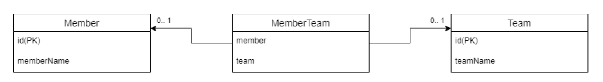

# 3주차 - 연관관계

## 목차

<!-- 목차 -->
- [목차](#목차)
- [연관관계 설계](#연관관계-설계)
  - [조인컬럼 사용](#조인-컬럼-사용)
  - [조인 테이블 사용 (연결 테이블, 링크 테이블)](#조인-테이블-사용-연결-테이블-링크-테이블)
  - [양방향 연관관계](#양방향-연관관계)
    - [양방향 매핑의 규칙](#양방향-매핑의-규칙)
    - [무한 순환 해결 방법](#무한-순환-해결-방법)
- [다양한 연관관계 설정](#다양한-연관관계-설정)
  - [다대일](#다대일)
  - [일대다](#일대다)
  - [일대일](#일대일)
  - [다대다](#다대다)
    - [연결 엔티티를 사용한 다대다 연관관계](#연결-엔티티를-사용한-다대다-연관관계)
<!-- /목차 -->

# 연관관계 설계

## 조인 컬럼 사용

- 테이블 간에 관계를 조인 컬럼이라 부르는 외래 키 컬럼을 사용해 관리
    - `@JoinColumn`으로 매핑
- 단점 - 조인이 가끔 맺어지는 관계라면 대부분 값이 null로 저장된다.
- Ex - 회원과 사물함의 관계가 있다고 가정
    - 회원이 사물함을 사용하지 않는다면, 아직 관계가 없으므로 회원 테이블의 외래키는 null
    - 즉, null을 허용하므로 **선택적 비식별 관계**이다.
    - 때문에, 조인 시 외부 조인(OuterJoin)을 사용하여야 한다.

## 조인 테이블 사용 (연결 테이블, 링크 테이블)

- 별도의 테이블을 사용해 연관관계를 관리
    - `@JoinTable`로 매핑
    - 이때, 조인 테이블에 외래키를 가지고 연관관계를 관리하고 각 테이블에는 외래키 컬럼이 없다.
    - 주로 다대다 관계를 일대다, 다대일 관계로 풀어내기 위해 사용
- 단점 - 조인하기 위해 테이블을 하나 추가해야한다.

## 양방향 연관관계

- 데이터베이스 테이블 : 외래키 하나로 양방향 조회 가능
- 객체 관계 : 단방향 매핑 추가
    
    **회원 엔티티**
    
    ```java
    @Entity
    public class Member{
    	@Id
    	@Column(name = "m_id")
    	private Long id;
    
    	@ManyToOne
    	@JoinColumn(name = "t_id")
    	private Team team;
    }
    ```
    
    **팀 엔티티**
    
    ```java
    @Entity
    public class Team{
    	@Id
    	@Column(name = "t_id")
    	private Long id;
    
    	@OneToMany(mappedBy = "team")
    	private List<Member> memberList = new ArrayList<>();
    }
    ```
    

### 양방향 매핑의 규칙

- JPA에선 두 객체 연관관계 중 하나를 정해 테이블의 외래키를 관리해 하는데 이를 **연관관계의 주인**이라 한다.
    - 연관관계의 주인만이 데이터베이스 연관관계와 매핑되고 외래 키를 관리할 수 있다.
        - 주인은 mappedBy 속성을 사용하지 않는다.
    - 주인이 아닌 쪽은 읽기(Read)만 가능
        - 주인이 아니면 mappeBy 속성을 사용해서 속성의 값으로 연관관계의 주인을 지정한다.
- 양방향 연관관계 설정 후 연관관계의 주인에 값을 입력하지 않고 주인이 아닌 곳에만 입력을 하게되면 다양한 이슈가 발생할 수 있다.
    - 때문에, 객체 관점에서 양쪽 방향에 모두 값을 입력해주는 것이 가장 안전.
- 양방향 매핑을 통해 엔티티를 관리하면 **무한 순환되는 문제**를 발견할 수 있다.
    
    ```java
    ...
    public class Member{
    	...
    }
    
    ...
    public class Team{
    	...
    }
    
    public class 양방향_Test{
    	@Test
    	void findByMemberName(){
    		Team team = Team.builder()
    			.teamName("team1")
    			.build();
    		teamRepository.save(team);
    		
    		Member member = Member.builder()
    				.memberName("member1")
            .build();
        member.setTeam(team);
    
        List<Member> memberList = new ArrayList<>();
        memberList.add(member);
    
        team.setMemberList(memberList);
        memberRepository.save(member);
    
        assertNotNull(memberRepository.findByMemberName(member.getMemberName())
    			.orElse(null););
    	}
    }
    ```
    

### 무한 순환 해결 방법

1. Entity로 반환하지 않고 DTO 활용
2. `@JsonIgnore` : Json으로 직렬화할 속성에서 무시
3. `@JsonManagedReference, @JsonBackReference` : 직렬화 방향 설정
4. `@JsonIdentityInfo` : 순환참조될 대상의 식별키로 구분하여 더 이상 순환참조되지 않게 설정
5. 연관 테이블을 생성하여 관계를 설정하는 방법
- **@JsonIgnore 사용하여 해결**
    
    ```java
    @JsonIgnore
    @ManyToOne(TargetEntity = Team.class, fetch = FetchType.LAZY)
    @Setter
    private Team team;
    
    @JsonIgnore
    @OneToMany(mappedBy = "team")
    @Setter
    private List<Member> memberList = new ArrayList<>();
    ```
    
- **@JsonManagedReference, @JsonBackReference을 사용하여 해결**
    
    ```java
    @JsonManagedReference
    @ManyToOne(targetEntity = Team.class, fetch = FetchType.LAZY)
    @Setter
    private Team team;
    
    @JsonBackReference
    @OneToMany(mappedBy = "team")
    @Setter
    private List<Member> memberList = new ArrayList<>();
    ```
    
- **@JsonIdentityInfo을 사용하여 해결**
    
    ```java
    ...
    @JsonIdentityInfo(
    	generator = ObjectIdGenerators.PropertyGenerator.class, 
    	property = "id"
    )
    public class Member {
    
        @Id
        @GeneratedValue(strategy = GenerationType.IDENTITY)
        private Long id;
    
    		...
    
        @ManyToOne(targetEntity = Team.class, fetch = FetchType.LAZY)
        @Setter
        private Team team;
    
    		...
    }
    
    ...
    @JsonIdentityInfo(generator = ObjectIdGenerators.PropertyGenerator.class, property = "id")
    public class Team {
    
        @Id
        @GeneratedValue(strategy = GenerationType.IDENTITY)
        private Long id;
    
    		...
    
        @OneToMany(mappedBy = "team")
        @Setter
        private List<Member> memberList = new ArrayList<>();
    	
    		...
    }
    ```
    
- **단반향으로만 양방향을 만들어서 해결**
    - 양방향으로 만들 엔티티 사이에 엔티티를 하나 더 만들어 간접적으로 양방향으로 만드는 방법
    - 이 방법의 경우 회원 엔티티와 팀 엔티티는 각 테이블을 알 수 없고, 연관 엔티티를 통해서만 접근이 가능하다.
    
    
    
    **회원 엔티티**
    
    ```java
    ...
    public class Member {
    
        @Id
        @GeneratedValue(strategy = GenerationType.IDENTITY)
        private Long id;
    
    		...
    }
    ```
    
    **팀 엔티티**
    
    ```java
    ...
    public class Team {
    		@Id
    		@GeneratedValue(strategy = GenerationType.IDENTITY)
    		private Long id;
    		
    		...
    }
    ```
    
    **연관 엔티티**
    
    ```java
    ...
    @Table(name = "tbl_member_team")
    public class MemberTeam {
    
        @Id
        @GeneratedValue(strategy = GenerationType.IDENTITY)
        private Long id;
    
        @ManyToOne(
    				targetEntity = Member.class, 
    				fetch = FetchType.LAZY
    		)
        private Member member;
    
        @ManyToOne(
    				targetEntity = Team.class, 
    				fetch = FetchType.LAZY
    		)
        private Team team;
    
    		...
    }
    ```
    

# 다양한 연관관계 설정

## 다대일

- **단방향**
    
    ```java
    @Entity
    public class Member {	
        @Id 
        @GeneratedValue
        private Long id;
    	
        @ManyToOne
        @JoinColumn(name = "team_id")
        private Team team;
    }
    ```
    
- **양방향**
    - 외래키가 있는 쪽이 연관관계의 주인 (항상 다에 외래키가 있다.)
    - 항상 서로 참조를 하고 있다.
    - 

## 일대다

- **단방향**
    - 매핑한 객체가 관리하는 외래키가 다른 테이블에 존재.
        - 즉, 본인 테이블에 외래키가 있으면 엔티티의 저장과 연관관계처리를 Insert SQL 한번으로 끝낼 수 있지만, 다른 테이블에 있기 때문에, 연관관계 처리를 위해서 Update SQL을 추가로 실행해야한다.
        - 때문에, **일대다 단방향 매핑보단 다대일 양방향 매핑을 권장**
- **양방향**
    - 완전 불가능한건 아니지만 없다고 생각하자.

## 일대일

- 주 테이블이나 대상 테이블 둘 중 어느 곳이나 외래키를 가질 수 있다.

## 다대다

- RDB는 정규화된 테이블 2개로 다대다 관계를 표현할 수 없다.
    - 즉, 다대다 관계를 일대다, 다대일 관계로 풀어내는 연관 테이블을 사용
        
        
        
- 객체는 테이블과 다르게 객체 2개로 다대다 관계를 생성

**단방향**

- `@JoinTable.name` : 연결 테이블 지정
- `@JoinTable.joinColumns` : 현재 방향인 엔티티와 매핑할 조인 컬럼 정보 지정
- `@JoinTable.inverse.JoinColumns` : 반대 방향인 엔티티와 매핑할 조인 컬럼 정보 지정

```java
@Entity
public class Member {

    @Id @GeneratedValue
    @Column(name = "member_id")
    private Long id;
    
    @ManyToMany
    @JoinTable(
		name = "member_product",
		joinColumns = @JoinColumn(name = "member_id"),
        	inverseJoinColumns = @JoinColumn(name = "product_id")
    )
    private List<Product> productList = new ArrayList<>();
 }
```

**양방향**

- 역방향도 @ManyToMany를 사용하고 mappedBy를 지정

```java
@Entity
public class Product {

    @Id
    @GeneratedValue
    @Column(name = "product_id")
    private Long id;
    
    @ManyToMany(mappedBy = "productList")
    private List<Member> memberList = new ArrayList<>();   
}
```

### **연결 엔티티를 사용한 다대다 연관관계**


**회원 엔티티**

```java
@Entity
public class Member {
    @Id  @GeneratedValue
    @Column(name = "member_id")
    private Long id;
    
    @OneToMany(mappedBy = "member")
    private List<MemberProduct> memberProductList
 }
```

**상품 엔티티**

```java
@Entity
public class Product {
    @Id @GeneratedValue
    @Column(name = "product_id")
    private Long id;
    
    private String productName;
    
    @OneToMany(mappedBy = "product")
    private List<MemberProduct> memberProductList
}
```

**연관 엔티티**

```java
@Entity
public class MemberProduct {
    @Id @GeneratedValue
    private Long id;
    
    @ManyToOne
    @JoinColumn(name = "member_id")
    private Member member;
    
    @ManyToOne
    @JoinColumn(name = "product_id")
    private Product product;    
}
```

<어떤 차이점이 있을까?>

ManyToMany는 연결 테이블이 자동으로 생성된다. 
반면 OneToMany 관계에서는 Member와 Product 엔티티 간에 연결 테이블이 생성되지 않는다. 
대신에, 연관 테이블 새로운 엔티티를 추가로 생성하여 엔티티 간의 연결을 관리한다.
ManyToMany 관계에서는 joinColumns 및 inverseJoinColumns를 사용하여 연결 테이블의 컬럼을 지정한다. 
OneToMany 관계에서는 대신에 연관 엔티티의 필드에 @JoinColumn 어노테이션을 사용하여 연결 테이블의 컬럼을 지정한다.
ManyToMany 관계에서는 연결 테이블의 유일한 기본 키를 사용하여 관계를 관리합니다. OneToMany 관계에서는 MemberProduct 엔티티의 기본 키를 사용하여 관계를 관리한다.

### <추가>

**<단방향>**
```java
@Entity
public class Member {

    @Id @GeneratedValue
    @Column(name = "member_id")
    private Long id;
    
    @OneToMany(mappedBy = "member")
    private List<MemberProduct> memberProductList = new ArrayList<>();
}

@Entity
public class Product {

    @Id @GeneratedValue
    @Column(name = "product_id")
    private Long id;
}

@Entity
public class MemberProduct {

    @Id @GeneratedValue
    @Column(name = "member_product_id")
    private Long id;
    
    @ManyToOne
    @JoinColumn(name = "member_id")
    private Member member;
    
    @ManyToOne
    @JoinColumn(name = "product_id")
    private Product product;
}
```

**<단방향>**
```java
@Entity
public class Member {

    @Id @GeneratedValue
    @Column(name = "member_id")
    private Long id;
    
    @OneToMany(mappedBy = "member")
    private List<MemberProduct> memberProductList = new ArrayList<>();
}

@Entity
public class Product {

    @Id @GeneratedValue
    @Column(name = "product_id")
    private Long id;
    
    @OneToMany(mappedBy = "product")
    private List<MemberProduct> memberProductList = new ArrayList<>();
}

@Entity
public class MemberProduct {

    @Id @GeneratedValue
    @Column(name = "member_product_id")
    private Long id;
    
    @ManyToOne
    @JoinColumn(name = "member_id")
    private Member member;
    
    @ManyToOne
    @JoinColumn(name = "product_id")
    private Product product;
}
```
