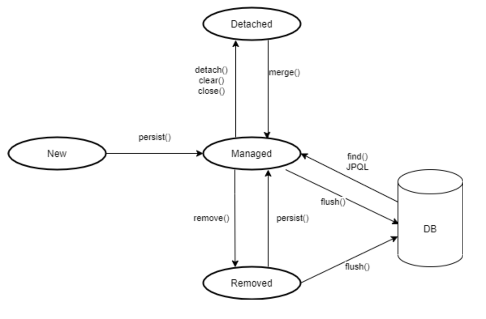

# 영속성 관리

## 목차

<!-- 목차 -->
- [영속성 관리](#영속성-관리)
  - [EntityManager와 EntityManagerFactory](#EntityManager와-EntityManagerFactory)
    - [EntityManageFactory](#**EntityManageFactory**)
    - [EntityManager](#EntityManager)
    - [일반적인 웹 애플리케이션 예시](#일반적인-웹-애플리케이션-예시)
  - [영속성 컨텍스트](#영속성-컨텍스트)
    - [엔티티의 생명주기](#엔티티의-생명주기)
    - [영속성 컨텍스트의 특징](#엔티티의-생명주기)
    - [영속성 컨텍스트의 장점](#영속성-컨텍스트의-장점)
  - [플러시](#플러시)
    - [플러시 실행 시 일어나는 일](#플러시-실행-시-일어나는-일)
    - [영속성 컨텍스트가 플러시하는 방법](#영속성-컨텍스트가-플러시하는-방법)
  - [더티 체킹 추가 설명](#더티-체킹-추가-설명)
- [영속성 전이(CASCADE)](#영속성-전이CASCADE)
    - [영속성 전이 : 저장](#영속성-전이-저장)
    - [영속성 전이 : 삭제](#영속성-전이-삭제)
    - [CASCADE의 종류](#CASCADE의-종류)
    - [고아 객체](#고아객체)
    - [영속성 전이 + 고아 객체, 생명 주기](#영속성-전이와-고아객체-생명주기)

<!-- /목차 -->

# 영속성 관리
- EntityManager는 Entity와 관련된 모든 일을 처리.
- 즉, Entity를 관리하는 관리자.
- **개발자 입장에서 EntityManager** : 엔티티를 저장하는 가상의 데이터베이스

## EntityManager와 EntityManagerFactory

### **EntityManageFactory**

- Entity를 만드는 공장
- 공장을 만드는 비용. 즉, 엔티티 매니저 팩토리를 만드는데 비용이 크다.
- 때문에 한 개만 만들어서 애플리케이션 전체에 공유하도록 설계

  **특징**

  - 엔티티 매니저 팩토리는 **여러 스레드가 동시에 접근해도 안전**하다.
  - 때문에 다른 스레드 간에 공유해도 문제가 되지 않는다.

### EntityManager

- 공장에서. 즉, EntityMangerFactory에서 EntityManager를 생성하는 비용은 작다.

  **특징**

  - 엔티티 매니저는 여러 스레드가 동시에 접근하면 **동시성 문제가 발생**한다.
  - 때문에, 스레드 간에 절대 공유하면 안된다.

### 일반적인 웹 애플리케이션 예시

1. EntityManagerFactory에서 다수 EntityManager 생성
2. 하나의 EntityManager는 연결이 꼭 필요한 시점까지 데이터베이스에 Connection 하지 않는다.
  - 예를 들어, 트랜잭션을 시작할 때 Connection을 획득
3. 또 다른 EntityManager는 Connection을 사용 중인데 트랜잭션을 시작할 때 Connection을 획득한 것으로 보인다.
  - 하이버네이트를 포함한 JPA 구현체들은 EntityManagerFactory를 생성할 때 커넥션 풀도 만든다.

## 영속성 컨텍스트

---

- 엔티티를 영구 저장하는 환경이다.
- 즉, 엔티티 매니저로 엔티티를 저장 혹은 조회하면 엔티티 매니저는 영속성 컨텍스트에 엔티티를 보관하고 관리한다.
- 예를 들면, `member.persist()`는 엔티티 매니저를 사용해서 회원 엔티티를 영속성 컨텍스트에 저장한다.

### 엔티티의 생명주기



- **비영속(new/transient) -** 영속성 컨텍스트와 관계가 없는 상태

    ```java
    /**
    	엔티티 객체 생성 - 현재 순수한 객체 상태
    	즉, 영속성 컨텍스트나 데이터베이스는 관련이 없는 상태
    */
    Member member = new Member();
    ```

  

- **영속(managed) -** 영속성 컨텍스트에 저장된 상태

    ```java
    /**
    	엔티티 매니저를 통해 엔티티를 영속성 컨텍스트에 저장
    	즉, 영속성 컨텍스트에 의해 관리된다.
    	em.persist() 뿐만 아니라 em.find() 등으로 사용해 조회한 엔티티도 영속 상태가 된다.
    */
    em.persist(member);
    ```

  

- **준영속(detached) -** 영속성 컨텍스트에 저장 됐다가 분리된 상태

    ```java
    /**
    	영속성 컨텍스트가 관리하던 영속 상태의 엔티티를 영속성 컨텍스트가 관리하지 않는 상태
    	즉, 준영속 상태의 엔티티는 영속성 컨텍스트가 제공하는 기능을 사용할 수 없다.
    	거의 비영속에 가깝, 식별자 값을 가지고 있다. 또한 지연 로딩을 할 수 없다.
    	em.detach() : 특정 엔티티만 준영속 상태 전환
    	close() : 영속성 컨텍스트를 종료
    	clear() : 영속성 컨텍스트를 완전히 초기화
    */
    em.detach(member);
    ```

- **삭제(removed) -** 삭제된 상태

    ```java
    /**
    	엔티티를 영속성 컨텍스트와 데이터베이스에서 삭제한 상태
    */
    em.remove(member);
    ```


### 영속성 컨텍스트의 특징

- **영속성 컨텍스트와 식별자 값**
  - 엔티티를 식별자 값(`@Id`로 테이블의 기본키와 매핑한 값)으로 구분
  - 즉, 영속 상태는 식별자 값이 반드시 있어야 한다. (없으면 예외)
- **영속성 컨텍스트와 데이터베이스 저장**
  - JPA는 보통 트랜잭션을 커밋하는 순간 영속성 컨텍스트에 새로 저장된 엔티티를 데이터베이스에 반영한다.
  - 이를 플러시(Flush)라 한다.

### 영속성 컨텍스트 장점
**<1차 캐시, 동일성 보장, 트랜잭션을 지원하는 쓰기 지연, 변겅 감지, 지연로딩>**
---
- **1차 캐시에서 조회**
  - 영속성 컨텍스트는 내부에 캐시를 가지는데, 이를 1차 캐시라 한다.
  - 영속 상태의 엔티티는 모두 이곳에 저장
  - 1차 캐시의 키는 식별자 값이고 값은 데이터베이스 기본키와 매핑되어 있다.
  - 즉, 영속성 컨텍스트에 데이터를 저장하고 조회하는 모든 기준은 기본키이다.
  - `em.find()` 호출 시 먼저 1차 캐시에서 찾고 없으면 데이터베이스에서 조회.

    

- **영속 엔티티의 동일성 보장**
  - 아래 코드에서 a==b는 참이다.
  - 왜냐하면, 반복해서 호출하여도 영속성 컨텍스트는 1차 캐시에 있는 같은 엔티티 인스턴스를 반환한다.

      ```java
      Member a = em.find(Member.class, "1");
      Member b = em.find(Member.class, "1");
      ```

- **트랜잭션을 지원하는 쓰기 지연**
  - 엔티티 매니저는 트랜잭션을 커밋하기 전까지 데이터베이스에 엔티티를 저장하지 않고 내부 쿼리 저장소에 `INSERT SQL`을 차곡차곡 모아둔다.
  - 그리고 트랜잭션을 커밋할 때 모아둔 쿼리를 데이터베이스에 보낸다.
  - **트랜잭션 쓰기 지연이 가능한 이유**는 트랜잭션 범위 내에서 실행되므로 모든 엔티티는 트랜잭션을 커밋하면 함께 저장되고 롤백하면 함께 저장되지 않는다. 즉, 커밋하지 않으면 아무 소용이 없는 것이고 어떻게든 커밋 직전에만 데이터베이스에 SQL을 전달하면 되기 때문에 가능하다.
  - **예를 들면 다음과 같다.**
    1. 먼저 회원 1을 생성하면 영속화가 되고, 영속성 컨텍스트는 1차 캐시에 저장하고 쓰기 지연 SQL 저장소에 쿼리를 보관한다.
    2. 다음으로 회원 2를 영속화하면 마찬가지로 1차 캐시에 등록하고 쓰기 지연 SQL 저장소에 쿼리를 저장한다.
    3. 마지막으로 트랜잭션을 커밋하면 엔티티 매니저는 영속성 컨텍스트를 플러시한다.
    4. 그러면 플러시(영속성 컨텍스트의 변경 내용을 데이터베이스에 동기화하는 작업)는 생성, 수정, 삭제한 엔티티를 데이터베이스에 반영한다.
    5. 즉, 쓰기 지연 SQL 저장소에 있는 모든 쿼리를 데이터베이스에 보낸다.

       

- **변경 감지**
  - SQL 수정 쿼리는 직접 작성해야하기 때문에 간접적이든 직접적이든 SQL에 의존하게 된다.
  - 하지만 JPA는 엔티티를 수정할 때 단순히 엔티티를 조회해서 데이터만 변경하면 된다.
  - 즉, 엔티티의 변경사항을 데이터베이스에 자동으로 반영하는 기능을 제공한다.(Dirty Checking)
  - 단, 영속 상태 엔티티에만 적용된다.
  - **예를 들면 다음과 같다.**
    1. 트랜잭션 커밋 시 엔티티 매니저 내부에서 플러시 호출
    2. 엔티티와 스냅샷을 비교하며 변경된 엔티티를 감지
    3. 변경된 엔티티 발견 시 수정 쿼리를 생성해 쓰기 지연 SQL에 저장
    4. 쓰기 지연 저장소의 SQL을 데이터베이스에 전송
    5. 데이터베이스 트랜잭션 커밋

       


- **지연 로딩**

## 플러시

---

- 플러시(`flush()`)는 영속성 컨텍스트의 변경 내용을 데이터베이스에 반영한다.
- **즉, 영속성 컨텍스트의 변경 내용을 데이터베이스에 동기화하는 것이다.**

### **플러시 실행 시 일어나는 일**

1. 변경 감지가 동작해서 영속성 컨텍스트에 있는 모든 엔티티를 스냅샷과 비교해서 수정된 엔티티를 찾는다.
2. 수정된 엔티티는 수정 쿼리를 만들어 쓰기 지연 SQL 저장소에 등록한다.
3. 쓰기 지연 SQL 저장소의 쿼리를 데이터베이스에 전송 (등록, 수정, 삭제 쿼리)

### **영속성 컨텍스트 플러시하는 방법**

1. em.flush()를 직접 호출
  - 테스트나, 다른 프레임워크와 JPA를 함께 사용할 때를 제외하고 거의 사용하지 않는다.
2. 트랜잭션 커밋 시 플러시 자동 호출
3. JPQL 쿼리 실행 시 플러시 자동 호출

---

# 더티 체킹 추가 설명

보통 수정 서비스를 개발할 때, 다음 코드처럼 데이터베이스에 쿼리를 날리지 않는 경우를 본 적이 있을 것이다.

```java
@Transactional
public void update(Long id, PostsUpdateRequestDto requestDto) {
		
		Posts posts = postsRepository.findById(id)
				.orElseThrow(() -> new IllegalArgumentException("해당 게시글이 없습니다. id="+ id));
	
		 posts.update(requestDto.getTitle(), requestDto.getContent());
 }
```

위에서도 설명했지만, 이게 가능한 이유는 JPA의 영속성 컨텍스트 때문이다.

**정리하자면,**

- 영속성 컨텍스트는 엔티티를 영구 저장하는 환경이다.
- 즉, JPA의 핵심 내용은 엔티티가 영속성 컨텍스트에 포함되어 있냐 아니냐로 갈린다.
- JPA의 엔티티 매니저가 활성화된 상태로 트랜잭션 안에서 데이터베이스에서 데이터를 가져오면 이 데이터는 영속성 컨텍스트가 유지된 상태이다.
- 이 상태에서 해당 데이터의 값을 변경하면 트랜잭션이 끝나는 시점에 해당 테이블에 변경분을 반영한다.
- 즉, Entity 객체의 값만 변경하면 별도로 Update 쿼리를 날릴 필요가 없다는 것이다.
- 이 개념을 더티 체킹dirty checking이라고 한다.

# 영속성 전이(CASCADE)

- 특정 엔티티를 영속 상태로 만들 때 연관된 엔티티도 함께 영속 상태로 만들때 사용.
- JPA에서 엔티티를 저장할 때 연관된 모든 엔티티는 영속 상태여야 한다.
- 단, 영속성 전이는 연관관계를 매핑하는 것과는 아무 관련이 없다.
- **단지 영속화할 때 연관된 엔티티도 같이 영속화하는 편리함을 제공할 뿐이다.**

### 영속성 전이 저장

```java
@Entity
public class Parent{
  ...
  @OneToMany(mappedBy = "parent", cascade = CascadeType.PERSIST)
  private List<Child> children = new ArrayList<>();
  ...
}
```
- 코드처럼 부모만 영속화하면 Cascade를 설정한 자식 엔티티까지 함께 영속화해서 저장된다.

### 영속성 전이 삭제
```java
@Entity
public class Parent{
  ...
  @OneToMany(mappedBy = "parent", cascade = CascadeType.REMOVE)
  private List<Child> children = new ArrayList<>();
  ...
}
```
- 코드처럼 부모만 영속화하면 Cascade를 설정한 자식 엔티티까지 함께 영속화해서 삭제된다.

### CASCADE의 종류
```java
public enum CascadeType {
  ALL,          //모두 적용 : 모든 영속성 전이 옵션을 적용
  PERSIST,      //영속 : 새로운 엔티티를 영속화할 때 적용(연관 엔티티 함께 저장)
  MERGE,        //병합 : 준영속 상태의 엔티티를 영속 상태로 변경할 때 적용(연관 엔티티 함께 수정)
  REMOVE,       //삭제 : 엔티티 삭제할 때 적용(연관 엔티티 함께 삭제)
  REFRESH,      //새로고침 : 엔티티 새로고침할 때 적용(연관 엔티티 함께 새로고침)
  DETACH        //분리 : 영속성 컨텍스트에서 분리할 때 적용(연관 엔티티 함께 분리)
}
```

### 고아객체

- JPA는 부모 엔티티와 연관관계가 끊어진 자식 엔티티를 자동으로 삭제하는 기능을 제공한다.
- 이를 고아 객체 제거라고 한다. (Orphan)
- **부모 엔티티의 컬렉션에서 자식 엔티티의 참조만 제거하면 자식 엔티티가 자동으로 삭제되는 기능이다.**
- **즉, 참조가 제거된 엔티티는 다른 곳에서 참조하지 않는 고아 객체로 보고 삭제하는 기능이다.**
- 단, 이 옵션은 `@OneToOne, @OneToMany` 에서만 사용 가능하다.

```java
@Entity
public class Parent {
  @Id @GeneratedValue
  private Long id;
  
  @OneToMany(mappedBy = "parent", orphanRemoval = true)
  private List<Child> children = new ArrayList<>();
}

...
        Parent parent = em.find(Parent.class, id);
        parent.getChildren().remove(0);     //자식 엔티티 컬렉션에서 제거
...
```

**실행결과**
```sql
  DELETE 
  FROM child
  WHERE id=?
```
- 코드를 보면 컬렉션에서 child를 제거하니 `orphanRemoval=true` 옵션으로 인해 디비의 데이터도 삭제되는 것을 볼 수 있다.
- 즉, 고아 객체 제거 기능은 영속성 컨텍스트를 플러시할 때 적용되므로 플러시 시점에 DELETE SQL이 실행된다.

### 영속성 전이와 고아객체, 생명주기

**`CascadeType.ALL + orphanRemoval=true`를 동시에 사용하면 다음과 같다.**
- 일반적으로 엔티티는 `EntityManager.persist()`를 통해 영속화 되고 `EntityManager.remove()`를 통해 제거된다.
- 이는 엔티티 스스로 생명주기를 관리한다는 뜻이니 이 두 옵션을 모두 활성화하면 부모 엔티티를 통해 자식의 생명주기를 관리할 수 있게 된다.